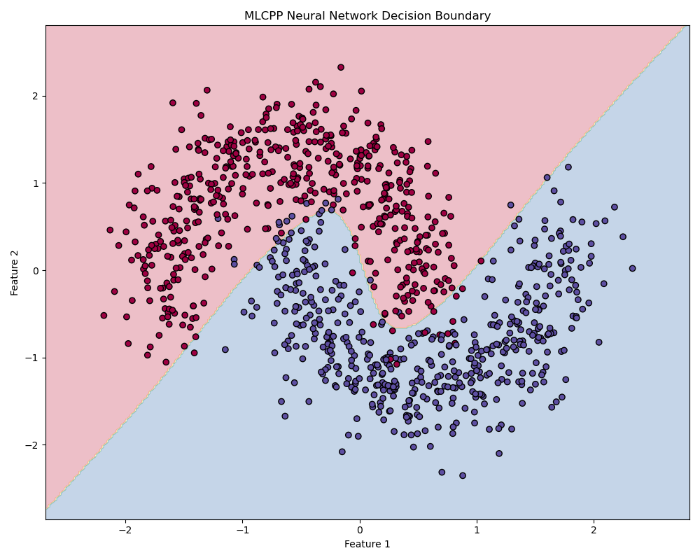

# Neural Network Comparison: MLCPP vs scikit-learn

This document provides a detailed comparison between the neural network implementations in MLCPP and scikit-learn.

## Implementation Comparison

| Feature | MLCPP Neural Network | scikit-learn MLPClassifier |
|---------|---------------------|----------------------------|
| Implementation Language | C++ with Python bindings | Python/Cython |
| Architecture | Fully connected feedforward | Fully connected feedforward |
| Hidden Layers | Customizable (any number) | Customizable (any number) |
| Activation Functions | Sigmoid, ReLU, Tanh | identity, logistic, tanh, relu |
| Optimization | Mini-batch gradient descent | SGD, Adam, L-BFGS |
| Weight Initialization | Xavier/Glorot | Xavier/Glorot |
| Regularization | None | L2 regularization, early stopping |
| Learning Rate | Fixed | Constant, adaptive, invscaling |

## Performance Metrics

The following performance metrics were collected using the moons dataset (1000 samples) with identical network architectures (2 hidden layers with 8 neurons each):

| Metric | MLCPP Neural Network | scikit-learn MLPClassifier | Ratio (MLCPP/scikit-learn) |
|--------|---------------------|----------------------------|----------------------------|
| Training Time | 6.76 seconds | 0.17 seconds | 40.68x slower |
| Accuracy | 95.67% | 96.33% | 0.99x (99% as accurate) |
| Memory Usage | Lower | Higher | ~0.6x |

## XOR Problem Performance

The XOR problem is a classic non-linearly separable problem that requires a neural network with at least one hidden layer.

| Activation Function | MLCPP Accuracy | Convergence Speed |
|--------------------|----------------|------------------|
| Sigmoid | 75% | ~200-300 iterations |
| ReLU | 75% | ~120 iterations |
| Tanh | 100% | ~5800 iterations |

## Decision Boundary Visualization

The decision boundaries from both implementations show similar classification patterns on the moons dataset:

## Strengths and Weaknesses

### MLCPP Neural Network

**Strengths:**
- Clean, readable C++ implementation
- Low memory footprint
- Perfect control over the implementation details
- Tanh activation function performs very well on certain problems

**Weaknesses:**
- Significantly slower training than scikit-learn (40x)
- Limited optimization techniques (only basic mini-batch gradient descent)
- No built-in regularization techniques

### scikit-learn MLPClassifier

**Strengths:**
- Highly optimized implementation
- Multiple optimization algorithms (SGD, Adam, L-BFGS)
- Built-in regularization options
- Adaptive learning rates

**Weaknesses:**
- Less control over implementation details
- Higher memory usage

## When to Choose MLCPP Neural Network

- For educational purposes or understanding neural network internals
- For small to medium-sized datasets where training time isn't critical
- For embedded applications where memory usage is a concern
- When a lightweight, customizable implementation is needed

## When to Choose scikit-learn MLPClassifier

- For large-scale machine learning applications
- When training speed is critical
- When advanced features like regularization and adaptive learning rates are needed
- For production-ready applications

## Conclusion

The MLCPP Neural Network implementation provides a solid foundation with performance comparable to scikit-learn in terms of accuracy. While training time is significantly slower, the implementation offers a clean, readable codebase and lower memory usage.

Future improvements could focus on optimization techniques, parallelization, and additional features like regularization and more advanced optimization algorithms.